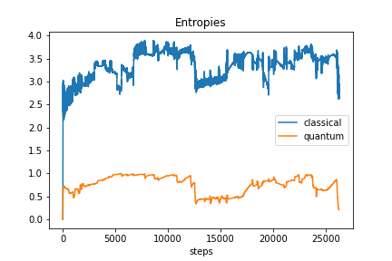
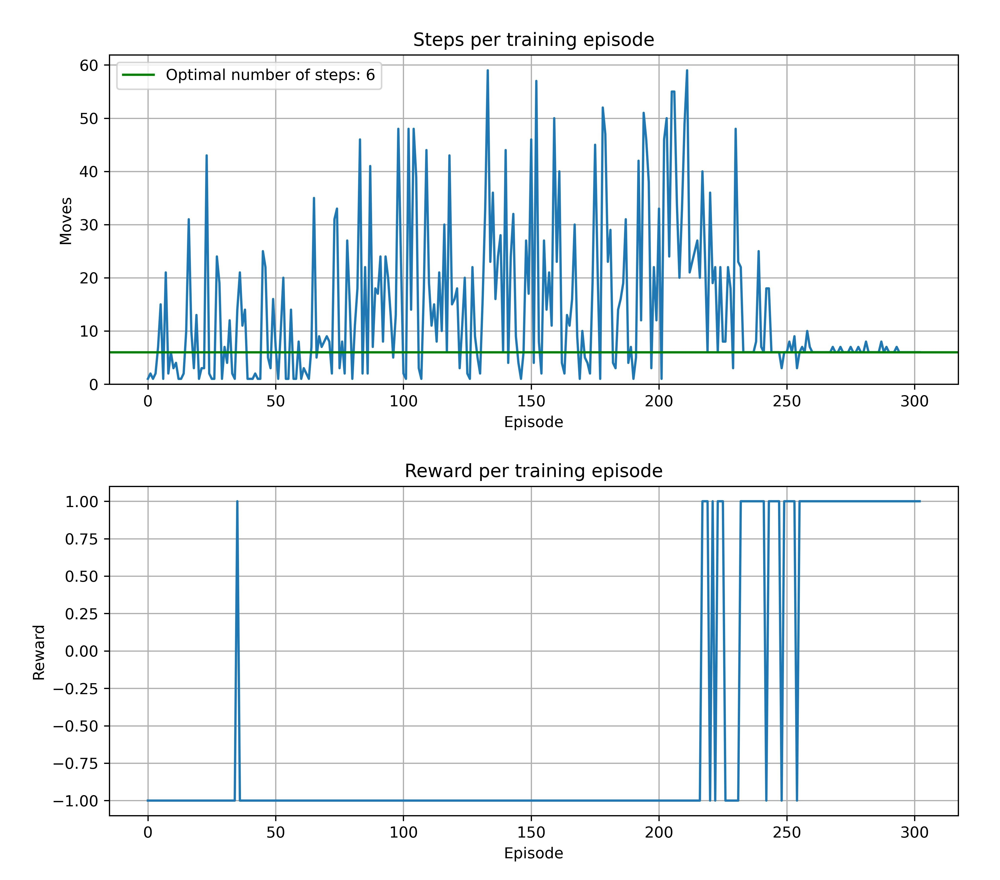
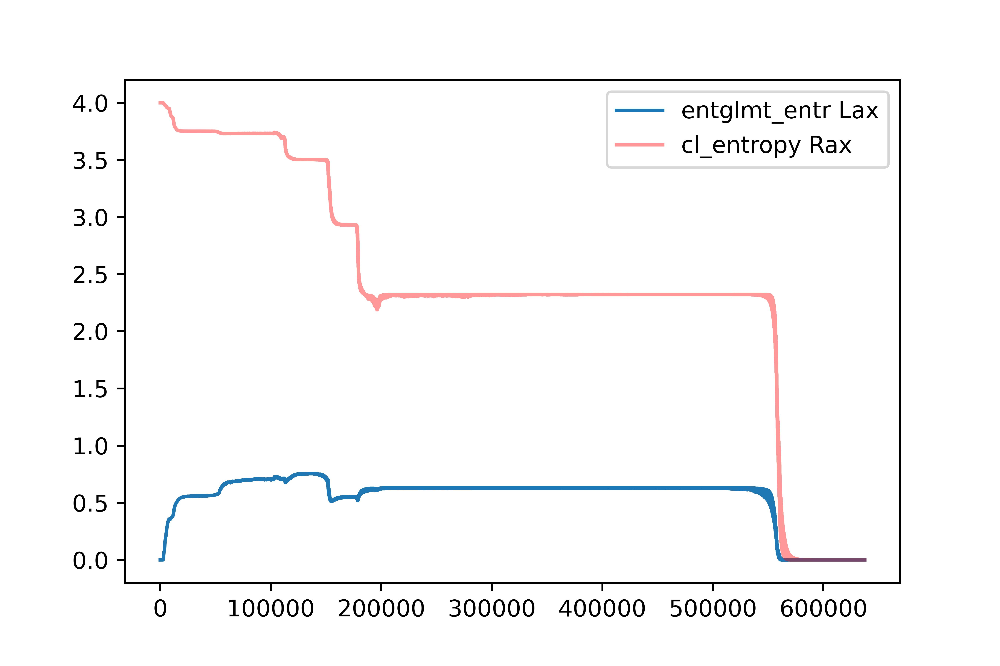

# Quantum Reinforcement Learning

## Requirements:

Code was developed and run on `Python` version `3.9.11`. All main requirements are in [`requirements`](./requirements.txt) file.

## Structure:

```
├───assets                              # assets for readme
├───results                             # results from training
│   ├───auto_hp_tuning                  # auto hyperparameter finetunign results directory
│   ├───classical_QL                    # classical Q-learning results directory
│   ├───classical_DQL                   # classical DQL results directory
│   ├───classical_DQL_sim_quantum       # classical DQL simulating quantum model results directory
│   └───quantum                         # quantum model results directory
│
├───scripts                             # scripts for generating results
│   ├───src                             # source code directory
│   ├───QML                             # quantum model directory
│   │   1._Classical_QL.py              # classical Q-learning
│   │   2._Classical_DQL.py             # classical Deep Q-learning
│   │   3._Classical_DQL_sim_quant.py   # classical Deep Q-learning simulating quantum circuit
│   │   3b._Classical_DQL_sim_quant_grid_search.py   # script no. 3 for grid search finetuning
│   │   3c._Classical_DQL_sim_quant_finetuning.ipynb # script no. 3 with automatic hyperparameter finetuning
│   │   auto_hp_tuning_visuals.py       # auto hyperparameter finetuning results ploting script
│   
└───tutorials                           # supplementary tutorials to start with

```


## Introduction

The concept of entropy is widely used in various machine learning methods. In this project we wanted to see, if this value behaves in the same way as an analogous quantity used in quantum physics - the entanglement entropy. To investigate this, we used both classical deep Q-learning and its quantum counterpart to train an agent to move in a simple Frozen Lake environment.

The output of a quantum circuit is of course a quantum state, for which the concept of entanglement entropy is pretty straightforward. In contrast, it's not as obvious in the case of classical RL. In that case, we were treating the output generated by the neural network as a quantum state (which in fact, is just some vector).

## Classical method

### Reinforcement learning

Q-learning is a machine learning algorithm of the "Reinforcement Learning" type. The family of such algorithms differs from supervised and unsupervised learning in that the information for training is collected not from data, but from the interaction of the **agent** (trained algorithm) with the **environment**. The function that the agent is guided by is called **politics** and takes the **observation** as an input (e.g. the position of a player on the board, car speed on the track) and returns an **action** (e.g. move right, add gas).

Further reading: https://en.wikipedia.org/wiki/Reinforcement_learning

### Classical Q-Learning

<br/>

>Run in [this script](./scripts/1._Classical_QL.py) 
🚀

<br/>

We will explain the concept of Q-learning on the example of an agent moving around the "FrozenLake" environment. Let's take a 4x4 element board:

```Python
import gym

lake = gym.make('FrozenLake-v1', is_slippery=False)
lake.reset()
lake.render()
```

SFFF

FHFH

FFFH

HFFG

**Legend:**
- S: starting point, one per board,
- F: frozen surface - safe field,
- H: hole - an ice hole, a field that gives a large penalty, or ends the game,
- G: goal, end point.

The agent is always in one of the spaces and, based on his policy, decides to move in one direction (left, right, up, down). The entire walk focuses on the reward, which the agent increases or decreases by entering a specific field.
Scoring example:

- Frozen surface: 0 or -0.01 to the reward (optional penalty to eliminate detour or walking in circles),
- Starting point: 0 or -0.01 to reward,
- Hole: -1 to the reward,
- End point: +1 to the reward.

Politics is a Q function that takes an action (e.g. move left) and a state (field 5 - second row from the top, second column from the right) as an input, and returns an appropriate reward. In the the most basic case (without the use of deep learning), the update of the politics (after each step) is represented by the Bellman equation:


Further reading: https://en.wikipedia.org/wiki/Q-learning


### Deep Q-Learning
<br/>

>Run in [this script](./scripts/2._Classical_DQL.py) 
🚀

<br/>

However, in our case, we use the so-called Deep Q-Learning (DQL). To make decisions, we use a neural network with a 16-element input (number of fields on the board) and a 4-element output, corresponding to the weights provided for each movement:

- 0 - move left,
- 1 - move down,
- 2 - move right,
- 3 - move up.

For example, if we would like to check which way is the best to go from the field number 5, we activate the neuron with index 4


We can access the exact values returned by the neural network as follows

```Python
agent.Qstate(4)
```
tensor([0.4165, 0.6063, 0.5308, 0.4209])


We can see, that the second element is the greatest in value, so the agent is going to move downwards.


### Implementation

The whole thing was coded in pytorch. The architecture of our model is a network consisting of linear layers, followed by a sigmoid activation function:
- https://pytorch.org/docs/stable/generated/torch.nn.Sigmoid.html
- https://pytorch.org/docs/stable/generated/torch.nn.Linear.html

The loss function used was the SmoothL1Loss: https://pytorch.org/docs/stable/generated/torch.nn.SmoothL1Loss.html

Several hundred epochs are enough to train a model. During the training we are tracking the percentage of cases, in which the walk ended up succesfully. For example, if the ratio of walks (over the last 50 epochs) during which the agent ended up in the goal field is equivalent to 90%, we are finishing the training process.


Below we present the average success rate over the last 50 epochs of training, during the total of 1000 epochs:

```Python
plt.figure(figsize=(12,5))
plt.plot(bin_stat.statistic)
plt.title(label=f'Percentage of succesfully finised walks (over the last {epoch_bin} epochs)')
plt.ylim(-1, 101)
plt.xlim(-1, (epochs+1)/epoch_bin)
plt.yticks(ticks=list(range(0, 110, 10)))
plt.xticks(ticks=bin_stat.bin_edges/epoch_bin-1, labels=bin_stat.bin_edges.astype(int))
plt.grid()
plt.show()
```


Additionally, we check whether the process is optimal or not. We strive for an algorithm that covers the route in 6 steps. If there is more of them, the algorithm is walking in circles. We are looking for the moment where it starts to oscillate around the optimal value. Therefore, we track how many steps an agent takes thanks to its politics, after each epoch:


```Python
plt.figure(figsize=(12,5))
plt.plot(t.jList)
plt.yticks(ticks=list(range(0, 110, 10)))
plt.title(label="Number of states done by the agent")
plt.grid()
plt.show()
```


Let's see how the trained agent works:


## Variational Quantum Circuit
<br/>

>Run from [this folder](./scripts/RUN_QML/) 
🚀

<br/>

In the quantum approach we are replacing the neural network with the so-called Variational Quantum Circuit (VQC). This is a type of quantum circuit with manipulable (classical) parameters. Like neural networks, VQCs can approximate arbitrary functions or classifiers. The following implementation is taken from

[S. Y.-C. Chen, C.-H. H. Yang, J. Qi, P.-Y. Chen, X. Ma and H.-S. Goan, *"Variational Quantum Circuits for Deep Reinforcement Learning"*, 2019](https://arxiv.org/abs/1907.00397)

### Encoding of the state

Recall that our task is, given a state (the place on the board where our agent is), to find the best corresponding move. The board contains 16 possible states (0-15), which can be encoded using 4 bits (0000-1111)

<!-- $$ b_1 b_2 b_3 b_4, $$ -->


or similarly 4 qubits

<!-- $$ |b_1\rangle \otimes |b_2\rangle \otimes |b_3\rangle \otimes |b_4\rangle. $$ -->


For example, if we are in the 13th state, its bitwise representation is 1101, which can be also written down using qubits' states as . 

Finally, the explicit gates which must be applied on consecutive qubits to encode agent's state are shown below:


Note, that we are using the  and  parameters. These parameters won't be trained in the further part of the procedure, and are only used to encode the state properly.

### Layers

On the encoded state we are acting with the following gates:


At the beginning we are entangling all of the qubits using the *CNOT* gates. Then, we are rotating each qubit along the *X*, *Y* and *Z* axes according to the following formula

<!-- $$ R(\alpha_i, \beta_i, \gamma_i) = R_x(\alpha_i) R_y(\beta_i) R_z(\gamma_i) $$ -->
&space;=&space;R_x(\alpha_i)&space;R_y(\beta_i)&space;R_z(\gamma_i))

,  and  are the parameters that will be optimized during each training's iteration (which also means, that the gradient will be calculated exactly over these variables).

At the very end we are conducting a measurement of each qubit and basing on the output we make a proper move. The whole circuit looks as follows:


### Early stopping

Because the training proces of VQC is very unstable we are (similarly as in the case of classical approach) using early stopping. We are terminating the procedure if during the last 20 epochs the reward didn't change and was positive.

## Extended classical model (NN simulating VQC)
<br/>

>Run in [this script](./scripts/3._Classical_DQL_sim_quant.py) 
🚀

<br/>
We have also tested classical Neural Network, which mimic quantum model behaviour. 
<br/>

It's important to note, that the state vector given by the VQC consists of  complex variables, where *n* is the number of qubits, which in our case gives 16 numbers. To resemble this situation as close as possible we are extending the classical model by increasing the number of neurons in each layer (also the output one) to 32. We are using 32 real numbers to encode 16 complex ones.

It should be noted, that unfortunately due to this extension the agent's training becomes more unstable and converges more slowly.


## Results
### Quantum DQN

 With earlystopping | WithOUT earlystopping 
 :---: | :---: 
 | 
 | 


As we can see, the two kinds of entropy behave differently and there is no obvious correltation between both of them (and also between entropies and the obtained reward).

### Classical Q-learnig:

Classical Q-learning model learns for wide range of parameters and has very predictible behaviour: 
 1. agent wanders until spots reward 
 2. then stays on that path usually optimizing path to the shortest one in few epochs
The only fun is to set hyperparamers to converge as fast as possible. 


We didn't calculate entanglement entropies here. This one is just complementary proof of concept.

### Deep Q-learning:

Learns slower than non-deep version and is slightly more sensitive to hyperparameters. Almost always converge to optimal number of steps but sometimes vary a lot along the way:



### Deep Q-learning simulating quantum circuit (Extended classical model):

Here was a lot of trouble to train this model. We were seeking best architecture and set of hyperparameters in 3 stages:

### **Finetuning stages:**
-----

#### **1. Manual finetuning on baseline model:**

* *Model*: one/two hidden layer and sigmoid activation function
* *Goal*: We perform a few experiments to gain a sense how and which hyperparamers influence our model training. Also we had baseline ranges to start more systematic searching
* *Results*: It turns out the model is very hard to train, in fact only for some very narrow ranges we obtained ~40% win ratio in last few epoch means. It occur rarely, only for some seeds. 

User can run our [script](./scripts/3._Classical_DQL_sim_quant.py), all paramers there are the results of this finetuning. 

#### **2. Grid search for the best architecture:**

* *Model*: 
    * **Hidden layers**: from 1 to 6 incl.
    * **Activation functions**: sigmoid, hyperbolic tangent and leaky relu with slope 0.1
* *Goal*: Here we put training with slightly lower hyperparameters, which gaves training 'pace' (learning rate, random paramer scaling etc.) and run every combination of tested architectures for `20'000` epochs to choose best architecture to hyperparameter finetuning.
* *Results*: 
    * None of the models trained to win. 
    * Most promising results shown leaky relu, but we quit it in next stage since it 'favors' positive values.
    * Tangent performs the worst.
    * Model starts to train for 1 and 2 hidden layers, for 3 and over hidden layers the architecture seems to be too complicated.

However, the one layer architecture with sigmoid activation function almost trained (has around 90% win ratio at the end of a training). Naturally we put it in **training with 30'000 epochs and it trained calling early stop on 22800 epoch**. Model converged to optimal number of steps, but the training history is very chaotic in comparison to the previous methods. 
This experiment information and history is in [this directory](./results/classical_DQL_sim_quantum/_BEST_1_layers_sigmoid_activation_longer/).

All the other results are in [release with full results](./results/classical_DQL_sim_quantum/) in `results` directory. They were too big to include them into main repository (weighting around 0.5 GB).  
Script used for training is [here](./scripts/3b._Classical_DQL_sim_quant_grid_search.py).

#### **3. Automatic hyperparamers finetuning :**

For this stage we used `pyTorch` [finetuning tutorial](https://pytorch.org/tutorials/beginner/hyperparameter_tuning_tutorial.html) with `ray`.

* *Model*: 
    * **Hidden layers**: from 1 to 2 incl.
    * **Activation functions**: sigmoid
* *Details*:
    * 150 experiments run 12 at once with scheduler setting next 16 in queue
    * 30'000 epochs per experiment, with grace period for early stopper from scheduler on 15'000 epochs. Early stopper was enabled to prevent wasting resources for models, that doesn't train.
    * We used [ray's ASHA scheduler](https://docs.ray.io/en/latest/tune/api_docs/schedulers.html)


* *Goal*: 
    * Final, automatic, full scale finetuning. 
* *Results*: 
    * only one of the experiments trained with lowered win ratio threshold set to 70% from last 100 epochs. (Gamma: ~`0.92`, learning rate: ~`0.008`, random scaling: ~`0.9998`, `1` hidden layer)
    * The only winner architecture is very similar to our parameters from previous stages:
        * Best model from 2nd stage: Gamma: `0.9`, learning rate: ~`0.0002`, random scaling: `0.9998`, `1` hidden layer.
    * 1 hidden layers model dominates in higher win ratio domain
    

| Results on scatter plot  | Results on triangular surface |
| ------------- | ------------- |
|   |   |
| Violet dots are models with 1 hidden layers. <br/> Yellow dots are models with 2 hidden layers. | |

All the details are in [results csv file](./results/auto_hp_tuning/results.csv).

Notebook used for training is [here](./scripts/3c._Classical_DQL_sim_quant_finetuning.ipynb). Finetuning was performed on desktop with i5-8600K 3.6 GHz CPU (6 CPUs) and Nvidia 2060 RTX GPU.

### **Results of classical model simulating quantum model**:

For best classical model simulating quantum model, we can see convergence of (both) entropies to zero, right in epochs, where model started to reach goal:




All parameters are in [results folder](./results/classical_DQL_sim_quantum/_BEST_1_layers_sigmoid_activation_longer/). 

However this method is incomparably harder to obtain effective model for environment. Not only in terms of hyperparameters sensitivity, but also from training duration and only small amount of 'succesful' experiments i.e. model which has mean win ratio over 40%. Also to obtain 'succesful' model we need to stop in right place i.e. for smaller win ratio early stop condition, which does not guarantee optimal path.

Interesting is, that models with 'real' quantum circuits (not simulated by neural network) were able to train, even if rarely. 
This shows that simulating quantum distributions for classical nerual networks can be tough. In our case particularly with:
* classical data encoded with basis embedding 
* classical data decoded with expectation values from Pauli Z operator (with flipped sign)

Similar conclusions, that quantum disribution can be hard to simulate, can be found in literature e.g. *Learning hard quantum distributions with variational
autoencoders* [Rochetto et, al. 2018](https://www.nature.com/articles/s41534-018-0077-z.pdf).

# Conclusions

We examined two kinds of entropy - the von Neumann (entanglement) entropy and Shannon entropy of the output vector (treated as a quantum state-vector) returned by different ML models. It's worth noticing, that these two values are the same, when we express the (quantum) state vector in the Schmidt basis (which can be obtained by means of the SVD). See [here](https://physics.stackexchange.com/questions/600120/von-neumann-entropy-vs-shannon-entropy-for-a-quantum-state-vector/608071#608071) for more details. However, the SVD is never conducted when training ML models, which justifies the different behaviour of the curves presented in above plots. However, we were not able to find any obvious relations between these two entropies, and also between them and the reward obtained by the agent.

We can see that in the case of a classical model trying to reproduce the behavior of a quantum model the two analyzed entropies differ from the one obtained from a truly quantum model. The two values begin their oscillations at a similar level, but for the classical model the entanglement entropy seems to be dropping faster. Also, classical model seems to be "more stable". However, these conclusions shouldn't be regarded as general rules, because in theory other agents might give a different behavior.

Finally, **we suggest, that the von Neumann entropy can be also used during the training of any (classical) ML model**, which outputs a vector of length $4^n$, for some integer $n$. In that case we would just treat the output as the state vector of some quantum system. **The maximization of entropy is widely used in RL by adding it as a bonus component to the loss function (as described [here](https://awjuliani.medium.com/maximum-entropy-policies-in-reinforcement-learning-everyday-life-f5a1cc18d32d) and [here](https://towardsdatascience.com/entropy-regularization-in-reinforcement-learning-a6fa6d7598df)), so it would be interesting to see, if we could gain some different behaviour of an agent by utilizing the entanglement entropy in a similar way**. It should be possible, because the von Neumann entropy is differentiable (see [here](https://math.stackexchange.com/questions/3123031/derivative-of-the-von-neumann-entropy), [here](https://math.stackexchange.com/questions/2877997/derivative-of-von-neumann-entropy) and [here](https://quantumcomputing.stackexchange.com/questions/22263/how-to-compute-derivatives-of-partial-traces-of-the-form-frac-partial-operat)).

## Authors:

M.Sc. Bartosz Rzepkowski, Janusz Twardak, Michał Łukomski, Marek Kowalik <marekkowalik97@gmail.com>. <br/>
Project was developed as part of [science club "Qubit"](http://qubit.pwr.edu.pl/) ([Wrocław University of Science and Technology](https://pwr.edu.pl/en/)) work.

## License:

Code and other materials are  under [MIT license](LICENSE).

> **Disclaimer**: <br/> Our project use fragments of code from other sources, sometimes with different licenses. All these fragments are marked properly. MIT license refers only to our original code.
